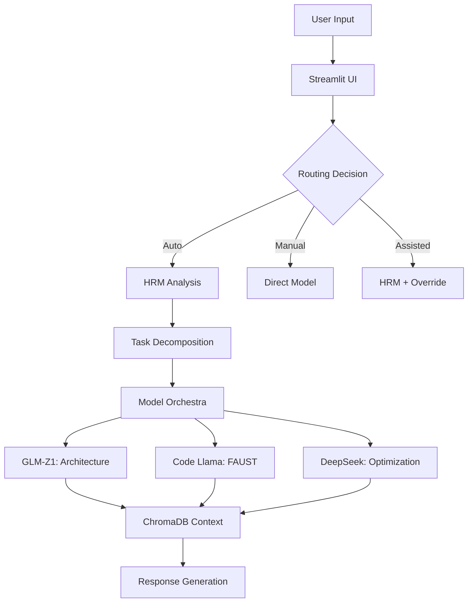

# 🎯 GLM-Z1 Multi-Model AI Development Assistant

**An autonomous, locally-running coding assistant specialized for FAUST/JUCE audio DSP development**

[](https://www.python.org/downloads/)
[](https://streamlit.io/)
[](LICENSE)
[-silver)](https://www.apple.com/)

## 🚀 Overview

A hierarchical multi-agent system featuring intelligent routing and specialized models for audio DSP development. Runs 100% locally on Apple Silicon (optimized for M4 Max) via Streamlit, combining the power of GLM-Z1 32B, Code Llama, and DeepSeek models with a Hierarchical Reasoning Model (HRM) for complex task decomposition.

### ✨ Key Features

- **🧠 Multi-Model Orchestra**: GLM-Z1 (reasoning) + Code Llama (FAUST) + DeepSeek (optimization)
- **🎛️ Intelligent Routing**: HRM-based automatic task analysis and model selection
- **📚 Knowledge Integration**: FAUST/JUCE documentation with ChromaDB vector search
- **✏️ Integrated Code Editor**: Syntax highlighting, AI-powered editing with diff view
- **🗂️ Project Management**: Persistent chat histories and file organization
- **⚡ MPS Acceleration**: Optimized for Apple Silicon M4 Max

## 📋 Requirements

### System Requirements
- **macOS** with Apple Silicon (M1/M2/M3/M4)
- **16GB+ RAM** (32GB+ recommended for GLM-Z1 32B)
- **50GB+ free disk space** for models
- **Python 3.10+**

### Model Requirements
- **Ollama** installed and running
- Models pulled via Ollama:
  - `JollyLlama/GLM-Z1-32B-0414-Q4_K_M:latest` - Main reasoning model (GLM-Z1 32B)
  - `codellama:13b` - FAUST specialist
  - `deepseek-coder:6.7b` - Fast optimization
  - `nomic-embed-text` - Embeddings for ChromaDB

## 🛠️ Installation

### 1. Clone the Repository
```bash
git clone https://github.com/Mando-369/glm_z1_project.git
cd glm_z1_project
```

### 2. Install Ollama
```bash
# Install Ollama (macOS)
curl -fsSL https://ollama.ai/install.sh | sh

# Start Ollama service
ollama serve

# Pull required models
ollama pull JollyLlama/GLM-Z1-32B-0414-Q4_K_M:latest
ollama pull codellama:13b
ollama pull deepseek-coder:6.7b
ollama pull nomic-embed-text
```

### 3. Create Virtual Environment
```bash
python -m venv venv
source venv/bin/activate  # On macOS/Linux
```

### 4. Install Dependencies
```bash
pip install -r requirements.txt
```

### 5. Set Up Documentation (Optional)
```bash
# Download FAUST documentation
python scripts/download_faust_docs_complete.py

# Download JUCE documentation
python scripts/download_juce_docs.py

# Download Python documentation
python scripts/download_python_docs.py
```

## 🚀 Usage

### Starting the System
```bash
# Activate virtual environment
source venv/bin/activate

# Run the Streamlit app
streamlit run main.py

# Access at http://localhost:8501
```

### Routing Modes

1. **🚀 Auto Mode**: Let HRM decide the best model
2. **🎯 Manual Mode**: Select model directly
3. **💡 Assisted Mode**: Get HRM recommendations

### Example Queries

**FAUST DSP Development**:
```
"Create a FAUST reverb with pre-delay and damping"
```

**Complex Architecture**:
```
"Design a real-time audio plugin architecture with JUCE"
```

**Code Optimization**:
```
"Optimize this C++ audio buffer processing code"
```

## 📁 Project Structure

```
glm_z1_project/
├── main.py                    # Streamlit entry point
├── setup.sh                   # Automated setup script
├── src/                       # Core application logic
│   ├── core/                  # System components
│   │   ├── multi_model_system.py    # Model orchestration
│   │   ├── project_manager.py       # Project management
│   │   ├── file_processor.py        # File processing
│   │   ├── context_enhancer.py      # Context enhancement
│   │   └── prompts.py              # System prompts
│   ├── ui/                    # User interface components
│   │   ├── editor_ui.py            # Code editor interface
│   │   ├── file_browser.py         # File browser
│   │   ├── file_editor.py          # File editing logic
│   │   └── ui_components.py        # UI component library
│   └── integrations/          # External integrations
│       ├── hrm_local_wrapper.py    # HRM integration
│       └── hrm_integration.py      # HRM orchestration
├── scripts/                   # Utility scripts
│   ├── download_faust_docs_complete.py  # FAUST docs downloader
│   ├── download_juce_docs.py            # JUCE docs downloader
│   ├── download_python_docs.py          # Python docs downloader
│   └── test_reorganization.py           # Structure validation
├── tests/                     # Test suite
│   ├── test_chromadb_validation.py     # ChromaDB tests
│   ├── test_hrm_integration.py         # HRM integration tests
│   └── populate_test_data.py           # Test data setup
├── lib/hrm/                   # Hierarchical Reasoning Model
├── chroma_db/                 # Vector databases
├── faust_documentation/       # FAUST DSP docs
├── juce_documentation/        # JUCE framework docs
├── projects/                  # User projects
├── .claude/                   # Claude Code agents (dev only)
├── .github/workflows/         # CI/CD pipelines
├── requirements*.txt          # Python dependencies (modular)
└── README.md                  # This file
```

## 🏗️ Architecture



## 🔧 Configuration

### Model Settings
Edit `config.yaml`:
```yaml
models:
  glm_z1:
    temperature: 0.7
    max_tokens: 4096
  code_llama:
    temperature: 0.5
    max_tokens: 8192
  deepseek:
    temperature: 0.3
    max_tokens: 4096

hrm:
  complexity_threshold: 0.6
  max_subtasks: 10
  enable_mps: true
```

### ChromaDB Settings
```yaml
chromadb:
  embedding_model: "all-MiniLM-L6-v2"
  embedding_dim: 768
  collection_size: 10000
```

## 🤝 Contributing

We welcome contributions! Please see [CONTRIBUTING.md](CONTRIBUTING.md) for guidelines.

### Development Setup
```bash
# Install development dependencies
pip install -r requirements-dev.txt

# Run tests
pytest tests/

# Run linting
flake8 .
black .
```

## 📊 Performance Benchmarks

| Task Type | Model | Avg Response Time | Quality Score |
|-----------|-------|------------------|---------------|
| FAUST DSP | Code Llama | 2.3s | 9.2/10 |
| Architecture | GLM-Z1 | 3.1s | 9.5/10 |
| Optimization | DeepSeek | 1.8s | 8.8/10 |
| Complex Multi-Task | HRM + All | 7.2s | 9.4/10 |

*Benchmarked on M4 Max with 64GB RAM*

## 🐛 Troubleshooting

### Common Issues

**Ollama Connection Error**:
```bash
# Ensure Ollama is running
ollama serve

# Check model availability
ollama list
```

**ChromaDB Initialization Error**:
```bash
# Reset database
rm -rf chroma_db/
python scripts/init_chromadb.py
```

**Memory Issues**:
```bash
# Use smaller model variants if available
ollama pull JollyLlama/GLM-Z1-13B-0414-Q4_K_M:latest  # If available, for lower memory
```

## 📚 Documentation

- [User Guide](docs/user_guide.md)
- [API Reference](docs/api_reference.md)
- [Model Documentation](docs/models.md)
- [HRM Implementation](docs/hrm.md)

## 🔮 Roadmap

- [ ] Extended C++20 documentation support
- [ ] WebAssembly FAUST compilation
- [ ] Real-time collaboration features
- [ ] Custom HRM training pipeline
- [ ] Audio-specific code validation
- [ ] VSCode extension
- [ ] Web-based UI option

## 📄 License

This project is licensed under the MIT License - see the [LICENSE](LICENSE) file for details.

## 🙏 Acknowledgments

- [Ollama](https://ollama.ai/) for local model serving
- [Streamlit](https://streamlit.io/) for the web interface
- [ChromaDB](https://www.trychroma.com/) for vector storage
- [FAUST](https://faust.grame.fr/) and [JUCE](https://juce.com/) communities

## 📧 Contact

- **GitHub Issues**: [Report bugs or request features](https://github.com/Mando-369/glm_z1_project/issues)
- **Discussions**: [Join the conversation](https://github.com/Mando-369/glm_z1_project/discussions)

---

<p align="center">Built with ❤️ for the audio DSP community</p>
<p align="center">⭐ Star this repo if you find it helpful!</p>